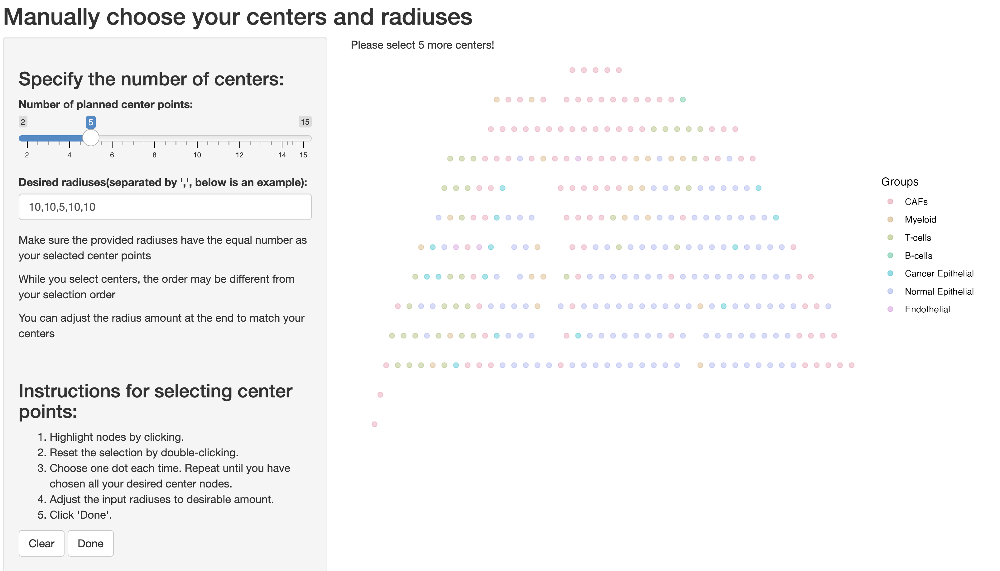

# Install RegionalST
To install this package, start R (version "4.3") and enter:

```{r install, eval = FALSE}
if (!requireNamespace("BiocManager", quietly = TRUE))
    install.packages("BiocManager")

BiocManager::install("RegionalST") 
```

# Preparing your data for RegionalST through BayesSpace

The data input step of RegionalST package relies on the package `r Biocpkg("BayesSpace")`. BayesSpace supports three ways of loading the data for analysis. 

First, reading Visium data through `readVisium()`:
This function takes only
the path to the Space Ranger output directory (containing the `spatial/` and
`filtered_feature_bc_matrix/` subdirectories) and returns a
`SingleCellExperiment`.
```{r readVisium, eval=FALSE}
sce <- readVisium("path/to/spaceranger/outs/")
```

Second, you can create a SingleCellExperiment object directly from the count matrix:
```{r manual.sce, eval=FALSE}
library(Matrix)

rowData <- read.csv("path/to/rowData.csv", stringsAsFactors=FALSE)
colData <- read.csv("path/to/colData.csv", stringsAsFactors=FALSE, row.names=1)
counts <- read.csv("path/to/counts.csv.gz",
                   row.names=1, check.names=F, stringsAsFactors=FALSE))

sce <- SingleCellExperiment(assays=list(counts=as(counts, "dgCMatrix")),
                            rowData=rowData,
                            colData=colData)
```

Lastly is to use the `getRDS()` function. Please check the manual of `r Biocpkg("BayesSpace")` if this step runs into any question. 

# Analysis with the incorporation of cell type proportions

## Obtain cell deconvolution proportions

For Visium platform, a single spot is usually consisting of multiple cells and thus analyzing it as a whole could reduce the accuracy. As a result, we suggest perform cell deconvolution analysis using `r Githubpkg("YingMa0107/CARD")` or RCTD (`r Githubpkg("dmcable/spacexr")`) or `r Githubpkg("BayraktarLab/cell2location")`. Below we show some example code of obtaining cell type proportions using CARD:
```{r CARDexample, eval=FALSE}
### read in spatial transcriptomics data for analysis
library(BayesSpace)
outdir = "/Dir/To/Data/BreastCancer_10x"
sce <- readVisium(outdir)
sce <- spatialPreprocess(sce, platform="Visium", log.normalize=TRUE)
spatial_count <- assays(sce)$counts
spatial_location <- data.frame(x = sce$imagecol,
                               y = max(sce$imagerow) - sce$imagerow)
rownames(spatial_location) <- colnames(spatial_count)

### assuming the single cell reference data for BRCA has been loaded
### BRCA_countmat: the count matrix of the BRCA single cell reference
### cellType: the cell types of the BRCA reference data
sc_count <- BRCA_countmat
sc_meta <- data.frame(cellID = colnames(BRCA_countmat),
                      cellType = cellType)
rownames(sc_meta) <- colnames(BRCA_countmat)

library(CARD)
CARD_obj <- createCARDObject(
    sc_count = sc_count,
    sc_meta = sc_meta,
    spatial_count = spatial_count,
    spatial_location = spatial_location,
    ct.varname = "cellType",
    ct.select = unique(sc_meta$cellType),
    sample.varname = "sampleInfo",
    minCountGene = 100,
    minCountSpot = 5) 
CARD_obj <- CARD_deconvolution(CARD_object = CARD_obj)

## add proportion to the sce object
S4Vectors::metadata(sce)$Proportions <- CARD_obj@Proportion_CARD
```


## Load example dataset
In our package, we create a small example dataset by subsetting the breast cancer Visium data from 10X. We already added the cell type proportion from deconvolution. In case deconvolution couldn't be performed or the data is of single cell resolution, we also provided the cell type label for each spot. Note that the Visium data is actually not single cell resolution, so the cell type label indicates the major cell type for each spot.
```{r loadExample, eval=TRUE}
set.seed(1234)

library(RegionalST)
library("gridExtra")
data(example_sce)

## the proportion information is saved under the metadata
S4Vectors::metadata(example_sce)$Proportions[seq_len(5),seq_len(5)]

## the cell type information is saved under a cell type variable
head(example_sce$celltype)
```


## Identify Regions of Interest (ROIs) with incorporation of proportions
First, we want to preprocess the data using the functions from BayesSpace:
```{r pre1, eval=TRUE, message = FALSE}
library(BayesSpace)
example_sce <- example_sce[, colSums(counts(example_sce)) > 0]
example_sce <- mySpatialPreprocess(example_sce, platform="Visium")
```

Second, we assign weights to each cell type and check the entropy at different radii.
```{r addweight, eval=TRUE, message=FALSE, progress=FALSE, results='hide'}
weight <- data.frame(celltype = c("Cancer Epithelial", "CAFs", "T-cells", "Endothelial",
                                  "PVL", "Myeloid", "B-cells", "Normal Epithelial", "Plasmablasts"),
                     weight = c(0.25,0.05,
                                0.25,0.05,
                                0.025,0.05,
                                0.25,0.05,0.025))
OneRad <- GetOneRadiusEntropy_withProp(example_sce,
                             selectN = length(example_sce$spot),
                             weight = weight,
                             radius = 5,
                             doPlot = TRUE,
                             mytitle = "Radius 5 weighted entropy")
```
<span style="color:blue">Note</span>: Here the `GetOneRadiusEntropy()` will calculate the entropy for all the spots (as `length(example_sce$spot)` is the length of all the spots). If this is too slow with a large dataset, you can specify to compute only a subset of the spots by argument, e.g., `selectN = round(length(example_sce$spot)/10)`. I use one tenth as an example, depending on the size of your data, you can try 1/3, 1/5, or 1/20 to generate entropy figures with different sparsities. The smaller `selectN` is, the faster this function will be.

### Automatic ROI selection
Then, we can use automatic functions to select ROIs:
```{r selectROI1, eval=TRUE, message=FALSE, progress=FALSE, results='hide'}
example_sce <- RankCenterByEntropy_withProp(example_sce, 
                                    weight,
                                    selectN = round(length(example_sce$spot)/5),
                                    topN = 3, 
                                    min_radius = 10,
                                    radius_vec = c(5,10),
                                    doPlot = TRUE)
### visualize one selected ROI:
PlotOneSelectedCenter(example_sce,ploti = 1)
```
<span style="color:blue">Note</span>: The `min_radius` argument controls the minimum distance between two closest identified ROI centers. If you specify a large min_radius, the ROIs will tend to have no or less overlaps. 

Let's visualize all the selected ROIs:
```{r vis1, eval=TRUE, message=FALSE, progress=FALSE, fig.show='hide'}
## let's visualize the selected regions:
palette <- colorspace::qualitative_hcl(9, 
                                       palette = "Set2")
selplot <- list()
topN <- 3
for(i in seq_len(topN)) {
    selplot[[i]] <- print(PlotOneSelectedCenter(example_sce,ploti = i))
}
selplot[[topN+1]] <- print(clusterPlot(example_sce, palette=palette, label = "celltype", size=0.1) ) 
```
```{r vis2, eval = TRUE}
do.call("grid.arrange", c(selplot, ncol = 2)) 
```
You can save your selected ROIs to an `.RData` file for future analysis and reproducible purposes:
```{r saveres, eval=FALSE}
thisSelection <- S4Vectors::metadata(sce)$selectCenters
save(thisSelection, file = "/Your/Directory/SelectionResults_withProportions.RData")
```

### Manual ROI selection
In addition to automatic selections, we can also manually select ROIs through a shiny app:
```{r shiny1, eval=FALSE}
example_sce <- ManualSelectCenter(example_sce)
S4Vectors::metadata(example_sce)$selectCenters
```

### Draw cell type proportions for the selected ROIs
```{r draw1, eval=TRUE}
DrawRegionProportion_withProp(example_sce,
                              label = "CellType",
                              selCenter = c(1,2,3))
```

## Perform Cross-regional Differential Analysis with proportions
One important downloaded analysis after we identified the ROIs is to understand the differentially expressed genes comparing one ROI to the other. Let's compare the first and the second ROIs.
```{r DE1, eval=TRUE, message=FALSE, progress=FALSE, warning=FALSE}
CR12_DE <- GetCrossRegionalDE_withProp(example_sce, 
                                       twoCenter = c(1,2),
                                       label = "celltype",
                                       angle = 30,
                                       hjust = 0,
                                       size = 3,
                                       padj_filter = 0.05,
                                       doHeatmap = TRUE)
dim(CR12_DE$allDE)
table(CR12_DE$allDE$Comparison)
## we find very few DE genes in the current dataset as the example data is very small and truncated.
```
We can similarly compare the first and third, the second and the third ROIs.
```{r DE2, eval=FALSE}
CR13_DE <- GetCrossRegionalDE_withProp(example_sce, 
                                       twoCenter = c(1,3),
                                       label = "celltype",
                                       padj_filter = 0.05,
                                       doHeatmap = TRUE)
CR23_DE <- GetCrossRegionalDE_withProp(example_sce, 
                                       twoCenter = c(2,3),
                                       label = "celltype",
                                       padj_filter = 0.05,
                                       doHeatmap = TRUE)
exampleRes <- list(CR12_DE,
                   CR13_DE,
                   CR23_DE)
```
As our current dataset is very small, we couldn't find much signals from it. We prepared another
example DE output. This result has been truncated and thus it is not a full list of genes. 
Let's take a look:
```{r DE3, eval=TRUE}
data("exampleRes")

## check the number of DEs for each cell type-specific comparison
table(exampleRes[[1]]$allDE$Comparison)
table(exampleRes[[2]]$allDE$Comparison)
table(exampleRes[[3]]$allDE$Comparison)

```


# Analysis with cell type information

## Obtain cell type labels
Here is some example code of annotating cell types for Visium 10X data when the cell type deconvolution is not feasible. 

```{r anno, eval=FALSE}
outdir = "/Users/zli16/Dropbox/TrySTData/Ovarian_10x"
sce <- readVisium(outdir)
sce <- sce[, colSums(counts(sce)) > 0]
sce <- spatialPreprocess(sce, platform="Visium", log.normalize=TRUE)
sce <- qTune(sce, qs=seq(2, 10), platform="Visium", d=15)
sce <- spatialCluster(sce, q=10, platform="Visium", d=15,
                      init.method="mclust", model="t", gamma=2,
                      nrep=50000, burn.in=1000,
                      save.chain=FALSE)
clusterPlot(sce)

markers <- list()
markers[["Epithelial"]] <- c("EPCAM")
markers[["Tumor"]] <- c("EPCAM","MUC6", "MMP7")
markers[["Macrophages"]] <- c("CD14", "CSF1R")
markers[["Dendritic cells"]] <- c("CCR7")
markers[["Immune cells"]] <- c("CD19", "CD79A", "CD79B", "PTPRC")

sum_counts <- function(sce, features) {
    if (length(features) > 1) {
        colSums(logcounts(sce)[features, ])
    } else {
        logcounts(sce)[features, ]
    }
}
spot_expr <- purrr::map(markers, function(xs) sum_counts(sce, xs))

library(ggplot2)
plot_expression <- function(sce, expr, name, mylimits) {
    # fix.sc <- scale_color_gradientn(colours = c('lightgrey', 'blue'), limits = c(0, 6))
    featurePlot(sce, expr, color=NA) +
        viridis::scale_fill_viridis(option="A") +
        labs(title=name, fill="Log-normalized\nexpression")
}
spot_plots <- purrr::imap(spot_expr, function(x, y) plot_expression(sce, x, y))
patchwork::wrap_plots(spot_plots, ncol=3)

#### assign celltype based on marker distribution
sce$celltype <- sce$spatial.cluster
sce$celltype[sce$spatial.cluster %in% c(1,2,6,8)] <- "Epithelial"
sce$celltype[sce$spatial.cluster %in% c(3)] <- "Macrophages"
sce$celltype[sce$spatial.cluster %in% c(4,5)] <- "Immune"
sce$celltype[sce$spatial.cluster %in% c(9,7,10)] <- "Tumor"
colData(sce)$celltype <- sce$celltype
```

## Load example dataset
We still use the same example dataset as the section above for illustration.
```{r loadExample2, eval=FALSE}
library(RegionalST)
data(example_sce)

## the cell type information is saved under a cell type variable
table(example_sce$celltype)
```

## Identify Regions of Interest (ROIs) with cell type information
```{r weight2, eval=TRUE, message=FALSE, warning=FALSE, results=FALSE}
weight <- data.frame(celltype = c("Cancer Epithelial", "CAFs", "T-cells", "Endothelial",
                                  "PVL", "Myeloid", "B-cells", "Normal Epithelial", "Plasmablasts"),
                     weight = c(0.25,0.05,
                                0.25,0.05,
                                0.025,0.05,
                                0.25,0.05,0.025))
OneRad <- GetOneRadiusEntropy(example_sce,
                              selectN = length(example_sce$spot),
                              weight = weight,
                              label = "celltype",
                              radius = 5,
                              doPlot = TRUE,
                              mytitle = "Radius 5 weighted entropy")
```

### Automatic selection of the ROIs
```{r select2, eval=TRUE, message=FALSE, warning=FALSE, fig.show='hide', results=FALSE}
example_sce <- RankCenterByEntropy(example_sce, 
                           weight,
                           selectN = round(length(example_sce$spot)/2),
                           label = "celltype",
                           topN = 3, 
                           min_radius = 10,
                           radius_vec = c(5,10),
                           doPlot = TRUE)
```

<span style="color:blue">Note</span>: The `min_radius` argument controls the minimum distance between two closest identified ROI centers. If you specify a large min_radius, the ROIs will tend to have no or less overlaps. 

Let's visualize all the selected ROIs:
```{r vis12, eval=TRUE, message=FALSE, progress=FALSE, fig.show='hide'}
## let's visualize the selected regions:
palette <- colorspace::qualitative_hcl(9, 
                                       palette = "Set2")
selplot <- list()
topN = 3
for(i in seq_len(topN)) {
    selplot[[i]] <- print(PlotOneSelectedCenter(example_sce,ploti = i))
}
selplot[[topN+1]] <- print(clusterPlot(example_sce, palette=palette, label = "celltype", size=0.1) ) 
```
```{r vis22, eval = TRUE}
do.call("grid.arrange", c(selplot, ncol = 2)) 
```
You can save your selected ROIs to an `.RData` file for future analysis and reproducible purposes:
```{r saveres2, eval=FALSE}
thisSelection <- S4Vectors::metadata(example_sce)$selectCenters
save(thisSelection, file = "/Your/Directory/SelectionResults_withProportions.RData")
```

### Manual ROI selection with cell type information
This section is exactly the same with or without proportion information. See Section \@ref(manual-roi-selection).

## Perform Cross-regional Differential Analysis with cell type information
```{r DE122, eval=FALSE}
## I didn't run this in the vignette as the current dataset has been truncated and couldn't find any DE genes
CR12_DE <- GetCrossRegionalDE_raw(example_sce, 
                                  twoCenter = c(1,2),
                                  label = "celltype",
                                  logfc.threshold = 0.1,
                                  min.pct = 0.1,
                                  angle = 30,
                                  hjust = 0,
                                  size = 3,
                                  padj_filter = 0.05,
                                  doHeatmap = FALSE)
```
Similarly we can perform cross regional analysis for other pairs:
```{r DE123, eval=FALSE}
CR13_DE <- GetCrossRegionalDE_raw(example_sce, 
                                  twoCenter = c(1,3),
                                  label = "celltype",
                                  padj_filter = 0.05,
                                  doHeatmap = FALSE)
CR23_DE <- GetCrossRegionalDE_raw(example_sce, 
                                  twoCenter = c(2,3),
                                  label = "celltype",
                                  padj_filter = 0.05,
                                  doHeatmap = FALSE)
```


# Pathway GSEA analysis based on the cross-regional DEs
```{r gsea1, eval=TRUE, message=FALSE, warning=FALSE, fig.show='hide', results=FALSE}
allfigure <- list()
allCTres <- DoGSEA(exampleRes, whichDB = "hallmark", withProp = TRUE)
for(i in seq_len(3)) {
    allfigure[[i]] <- DrawDotplot(allCTres, CT = i, angle = 15, vjust = 1, chooseP = "padj")
}
```
```{r,gsea2, eval=TRUE, fig.width=20, message=FALSE, warning=FALSE,fig.height=8, results=FALSE}
do.call("grid.arrange", c(allfigure[c(1,2,3)], ncol = 3)) 
```
```{r,gsea22, eval=TRUE, message=FALSE, warning=FALSE, results=FALSE}
### draw each cell type individually, here I am drawing cell type = 3
DrawDotplot(allCTres, CT = 3, angle = 15, vjust = 1, chooseP = "padj")
```
<span style="color:blue">Note</span>: In addition to "hallmark", the pathway database can also be "kegg" or "reactome". If you prefer other databases, you can set the `gmtdir=` argument as the directory to the gmt file of another database in `DoGSEA()` function.
```{r gsea3, eval=TRUE, warning=FALSE, message=FALSE}
allCTres <- DoGSEA(exampleRes, whichDB = "kegg", withProp = TRUE)
DrawDotplot(allCTres, CT = 3, angle = 15, vjust = 1, chooseP = "padj")
```
```{r gsea4, eval=TRUE, warning=FALSE, message=FALSE, fig.width=15, fig.height=8}
allCTres <- DoGSEA(exampleRes, whichDB = "reactome", withProp = TRUE)
DrawDotplot(allCTres, CT = 3, angle = 15, vjust = 1, chooseP = "padj")
```

# Session info {.unnumbered}

```{r sessionInfo, echo=FALSE}
sessionInfo()
```
